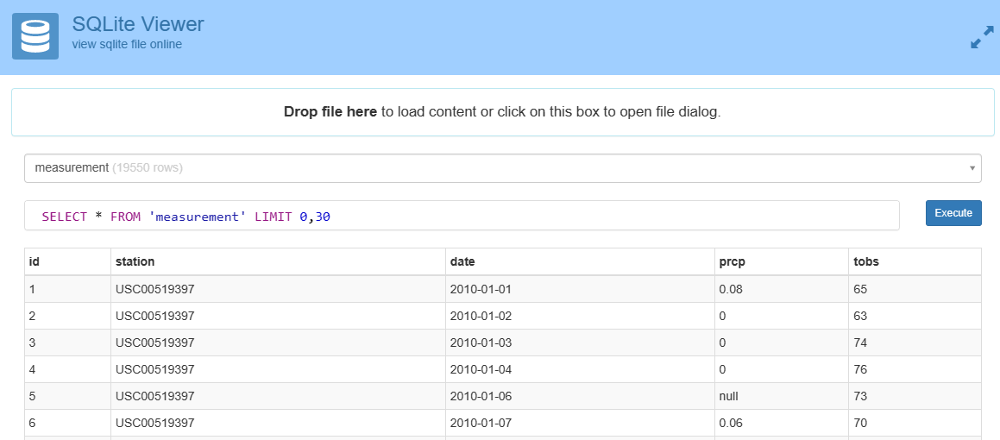
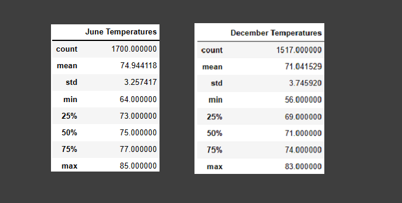
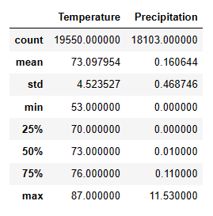

# surfs_up
Module 9: Surf's Up with Advanced Data Storage and Retrieval (using SQLite, SQLAlchemy and Flask)

## Analysis Overview:
The Surf and Shake shop’s business plan has been presented. The investors are interested.

One of the investors, W.Avy, has made a previous investment in a Surf and Shake shop. His shop didn't do so well. To put it lightly, it was "rained out of existence". So, before investing, he has requested a weather analysis for the island of Oaha.

We appreciate W.Avy's experience and we're sure glad he has pointed out this possible risk. To do the analysis, W.Avy gave us weather data for 7 years, from Jan 1st, 2010 to August 8th, 2017.

## Results: 
During initial analysis, https://inloop.github.io/sqlite-viewer/ was used to explore the data.
 
 While looking at this data, it was discovered the data consisted of multiple daily readings for temperature and precipitation at 12 different stations. After the initial weather analysis presented, W.Avy specifically asked for June and December data.

 

#### Surfing side by side, we discover some things about our data: 
-	There is only four degrees difference between June and December’s average temperatures.
-	There standard deviation for both is small, only three to four degrees.
-	Each quartile only shows three to four degrees difference. 
-	The largest difference comes with the minimum temperatures. There is a difference of eight degrees. 
-	The smallest difference is the max temperatures, only two degrees.

On top of doing W.Avy's requests, I was also interested in seeing the statistics over the entire data set. To my surprise, the stats were impressive. (Below)

## Summary:
Though the statistics above paint a positive picture and give us most of information needed to make good decisions, it might be a good idea to have the statistics broke up into the number of days as well as percentages. The following questions should be answered: 

1) How many days does it rain in Oaha? What is this as a percent?
2) When it rains, how long does it rain?
3) What percentage of days is the temperature not good for surfing or over 70 degrees for tourists to come out?
4) Also, it might be good to look at the precipitation and temperatures on the same plot for the enter ten years.
